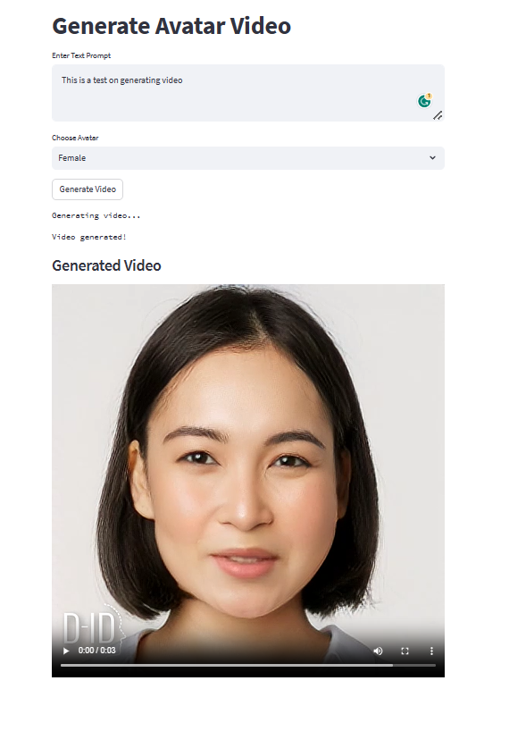

# Avatar Video Generator using Python, D-ID API and Streamlit

This is a Python script that generates an avatar video from text using the D-ID API and Streamlit for user interaction.
The script allows you to select between male and female avatars, input a text prompt, and generate a video with the selected avatar
narrating the provided text.



## Prerequisites

- Python 3.6+
- Streamlit
- Requests
- Dotenv

## Installation

1. Clone this repository or download the provided script.

2. Install the required dependencies using pip:

   ```bash
   pip install streamlit requests python-dotenv
   ```

3. Set up your D-ID API credentials:

   - Obtain an API key from the D-ID website.
   - Create a `.env` file in the same directory as the script.
   - Add your API key to the `.env` file:

     ```env
     API_KEY_DID=your_api_key_here
     ```

## Usage

1. Run the Streamlit app using the following command:

   ```bash
   python -m streamlit run main.py
   ```

2. The Streamlit app will open in your default web browser.

3. Enter a text prompt in the provided input area.

4. Choose between "Male" and "Female" avatars using the dropdown menu.

5. Click the "Generate Video" button to initiate the video generation process.

6. The app will display a message indicating that the video is being generated.

7. Once the video is generated, it will be displayed in the "Generated Video" section of the app.

## About the Code

- The script uses the Streamlit library to create a user interface for input and interaction.
- Avatars are selected using a dropdown box, and a text prompt is entered using a text area.
- The `generate_video` function sends a request to the D-ID API to create the avatar video based on the input parameters.
- The generated video is displayed in the Streamlit app using the `st.video` function.

## Notes

- This script uses the D-ID API to generate avatar videos. Make sure you have valid API credentials and permissions to use the D-ID service.
- The video generation process may take some time, and the script includes logic to periodically check the status of the video generation.

For more information on the D-ID API and Streamlit, refer to the following resources:

- D-ID API Documentation: [D-ID API Documentation](https://docs.d-id.com/)
- Streamlit Documentation: [Streamlit Documentation](https://docs.streamlit.io/)
- D-ID Website: [D-ID](https://d-id.com/)
